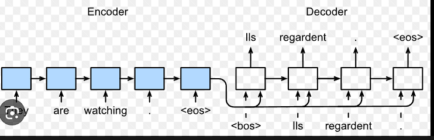

# Brain storming:

What are our Diacritics :

| Arabic Diacritic  | Unicode Character | Symbol |
| ----------------- | ----------------- | ------ |
| Fatḥah           | U+0621            | َ     |
| Dammah            | U+0625            | ُ     |
| Kasrah            | U+0623            | ِ     |
| Shadda            | U+062F            | ّ     |
| Sukun             | U+0651            | ْ     |
| Maddah            | U+0622            | ٓ     |
| Hamza             | U+0621            | ء     |
| Alif Khanjarīyah | U+0622            | أ     |
| Alif Maqṣūrah   | U+064A            | ى     |
| Waw Maqṣūrah    | U+0649            | و     |
| Tanween Fatḥah   | U+064A            | ً     |
| Tanween Kasrah    | U+0649            | ٍ     |
| Tanween Dammah    | U+0648            | ٌ     |

- begin with basic diacritics classes then append if u find a new oneobvious first thing is to separate the Diacritics from the arabic char while storing the position of it for example :  data[i] = ذَھَب َﻋﻠٌِﻲ إَﻟﻰ اْﻟﱠﺷﺎِطِﺊ

x = split_Training(data[i]) = ذھب ﻋﻠﻲ إﻟﻰ اﻟﺷﺎطﺊ

y = split_Training(data[i]) = [diacritics]

- we need to know where to split the arabic sentence.
- regex will not work i guess so need to find other way

another important note :

- we dont need to train on data that not expected to have diacritics we should train on words data only while saving information about the sentence eg; dont train on fullstops or commas other than that save their location and restore them after predictiong diacritics.
- [words] -> model -> [words diacritized] -> add fullstops

important thing i noticed that arabic word is represented by two char one for diacritics and one for char

- we need to get some feature vector for each word
- nd5lhom 3ly RNN to learn the context of the word
- 5ly balk al e3rab hayfr2 f alklam ely ably w ely b3dy
- مبتدا موخر w alklam da
- 22dr a5od al vector ely tl3 da ast5dmo ka initial weight wana b train beh 3ly char level
- second model output is classification algorithm for each char ytl3 output (seq --> seq)

  

f dma8y 7aga shabah keda

second Rnn dy momkn tkon LSTM or BiLSTM momkn n search 3alehom bs ayan kan momkn ay model tany a7sn mn RNN we are free to use anything we need.

lw ragl tal3 output b2a

Preprocessing:

1. split on full stops then on panctuation marks
2. tokinize
3. map each diacritic to an english symbol for simplicity fatha --> a ....etc

the output of this stage list of list
